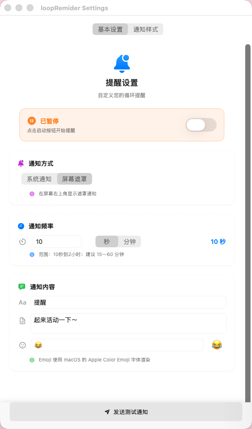
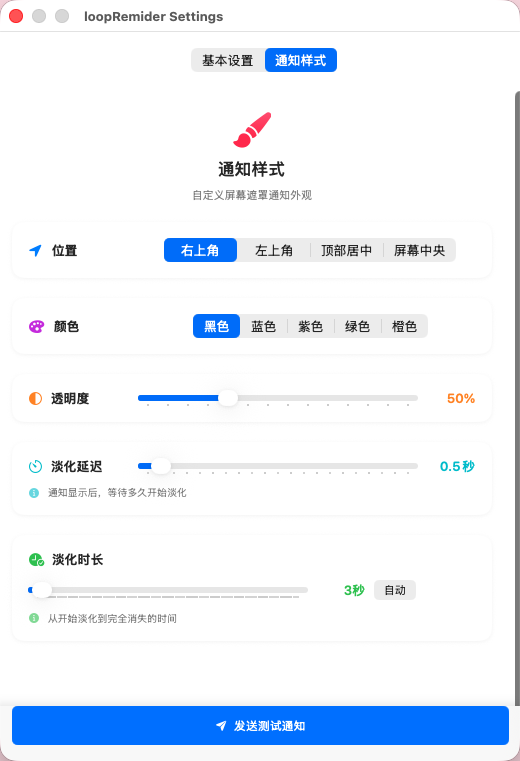
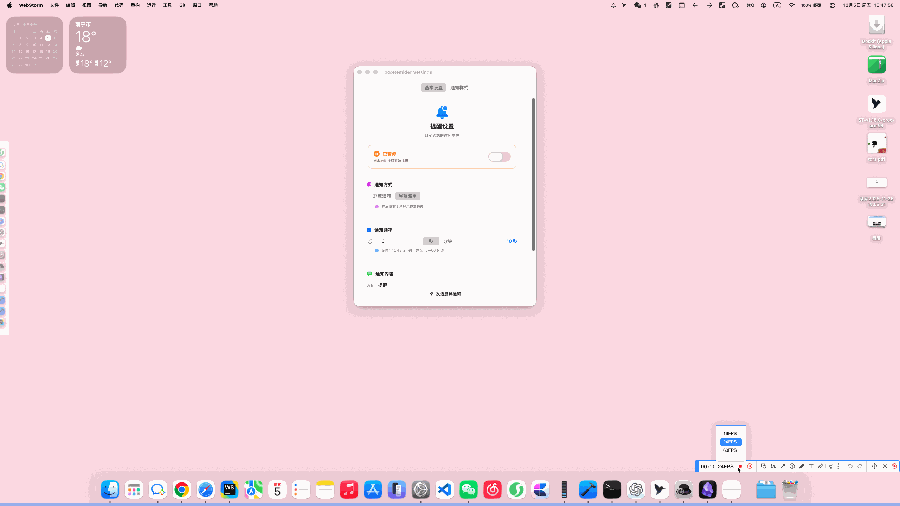

# Loop Reminder

一款简洁的 macOS 菜单栏循环提醒应用，帮助你定时休息、活动身体。

## ✨ 功能特点

- 🔔 **双通知模式**：支持系统通知和屏幕遮罩通知
- ⏰ **灵活间隔**：10秒到2小时任意设置提醒频率
- 🎨 **自定义样式**：自由调整遮罩位置、颜色、透明度和淡化效果
- 🚀 **轻量高效**：常驻菜单栏，低资源占用
- 💾 **自动保存**：所有设置自动保存，无需手动配置

## 📸 界面预览

### 主界面

### 通知效果

## 📦 下载安装

1. 前往 [Releases]() 页面下载最新版本
2. 解压下载的 `.zip` 文件
3. 将 `Loop Reminder.app` 拖动到"应用程序"文件夹
4. 双击运行应用

> **提示**：首次运行时，如果遇到"无法打开"的提示，请在"系统偏好设置 > 隐私与安全性"中允许运行。

## 🎯 使用方法

1. **启动应用**：运行后会在菜单栏显示一个铃铛图标
2. **开始提醒**：点击菜单栏图标，选择"启动"
3. **配置设置**：点击"配置…"进入设置界面

### 基本设置

- **通知方式**：选择系统通知或屏幕遮罩
- **通知频率**：设置提醒间隔时间
- **通知内容**：自定义标题、内容和图标

### 通知样式（仅遮罩模式）

- **位置**：右上角、左上角、顶部居中、屏幕中央
- **颜色**：黑色、蓝色、紫色、绿色、橙色
- **透明度**：调整遮罩的不透明度
- **淡化延迟**：通知显示后多久开始淡化
- **淡化时长**：从开始淡化到完全消失的时间（支持自动模式）

## 🔧 系统要求

- macOS 14.0 或更高版本
- 支持 Apple Silicon (M1/M2/M3) 和 Intel 芯片

## 📝 开发

本项目使用 SwiftUI 开发，采用 MenuBarExtra 实现菜单栏集成。

## 📄 许可证

MIT License

---

**提示**：使用过程中有任何问题或建议，欢迎提 Issue！
