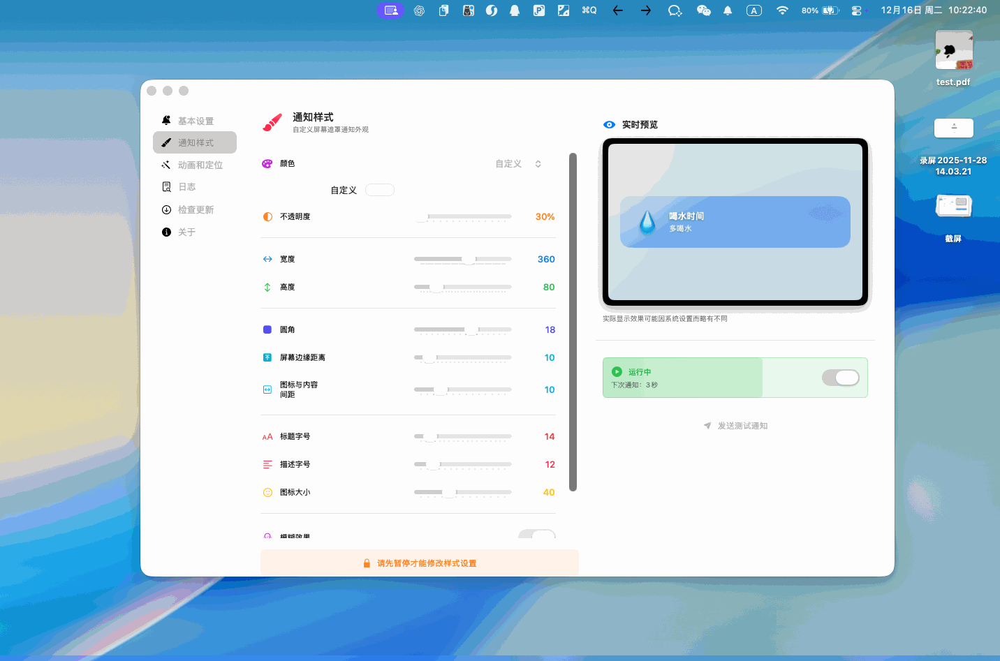
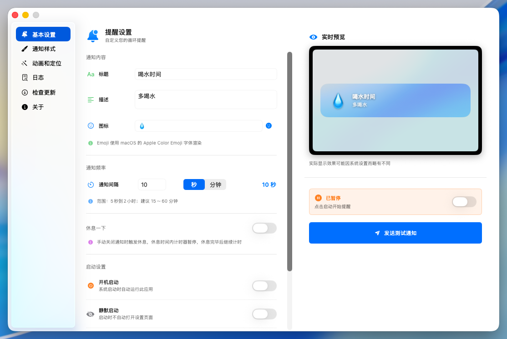
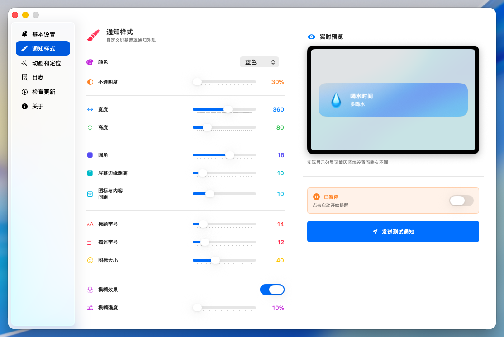
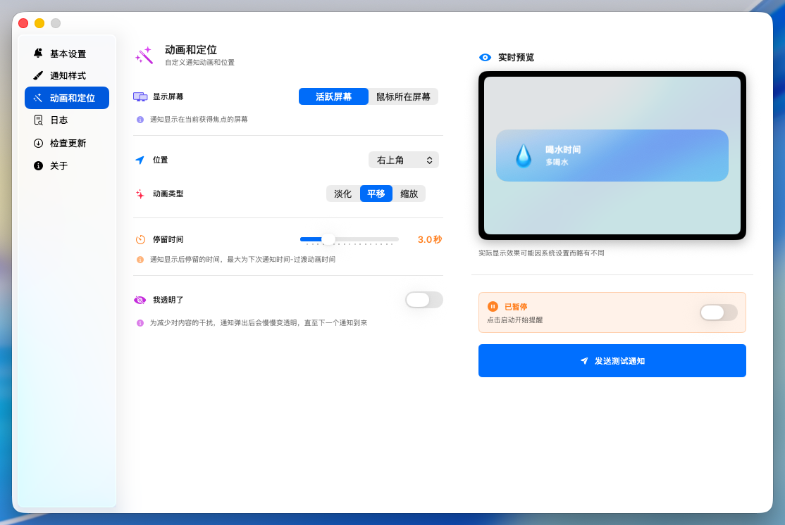
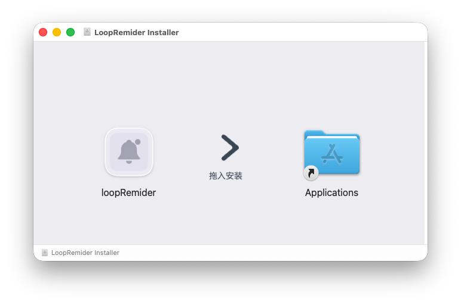
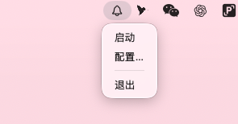

  
  
  # Loop Reminder
  
  一款简洁优雅的 macOS 循环提醒工具，帮助你保持健康的工作习惯。
  
  [中文](README.md) | [English](README.en.md)

## 📦 下载

- **"快上车" ➡️**：__[GitHub Releases](https://github.com/PeixinLu/MacOS-LoopRemider/releases)__

## ✨ 特性

- ⏰ **灵活提醒** - 自定义提醒间隔，定时提醒你休息活动
- 🌈 **超高度自定义** - 提醒内容、位置、颜色、尺寸、透明度、圆角大小等丰富配置项
- ✨ **精美动画** - 多种进入/退出动画效果可选，流畅优雅
- 🚀 **轻量高效** - 常驻菜单栏，低资源占用
- 🎨 **双通知模式** - 支持系统通知和屏幕遮罩（默认）两种方式
- 💫 **渐透明效果** - 通知可在停留期间逐渐变透明，减少干扰
- 🌟 更多特性等你发现...

## 📸 预览

  
  
  **通知效果**

<table>
  <tr>
    <td align="center"></td>
    <td align="center"></td>
    <td align="center"></td>
  </tr>
  <tr>
    <td colspan="3" align="center"><b>配置项</b></td>
  </tr>
</table>

## 🎯 使用

1. [下载最新版本](https://github.com/PeixinLu/MacOS-LoopRemider/releases)并安装
   
   

2. 点击菜单栏"铃铛"图标打开设置
   
   

3. 配置提醒内容、频率和样式、动画效果
   
   

4. 点击"启动"开始循环提醒
   
   

## 🔧 系统要求

- macOS 14.0+(目前暂时仅在macOS26下经过测试)
- 如果需要更多版本支持，请[告诉我](https://github.com/PeixinLu/MacOS-LoopRemider/issues/new)

## 📝 开发

- 基于 SwiftUI 和 MenuBarExtra 构建。
- 网络请求用于检查版本更新

## 🙏 致谢

感谢以下开源项目的支持：

- [LaunchAtLogin-Modern](https://github.com/sindresorhus/LaunchAtLogin-Modern) - 优雅的开机启动管理库
