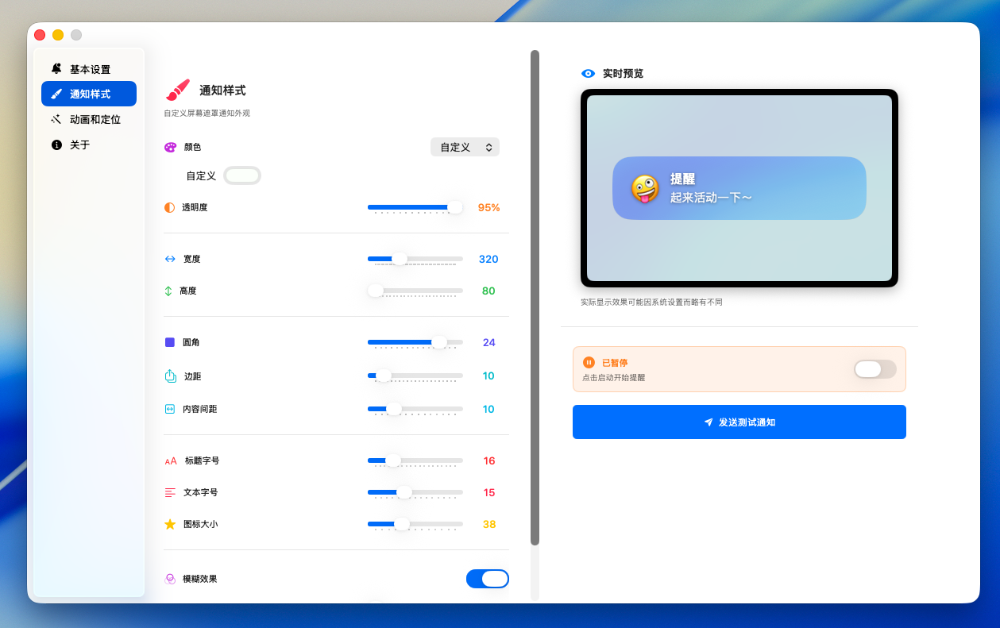
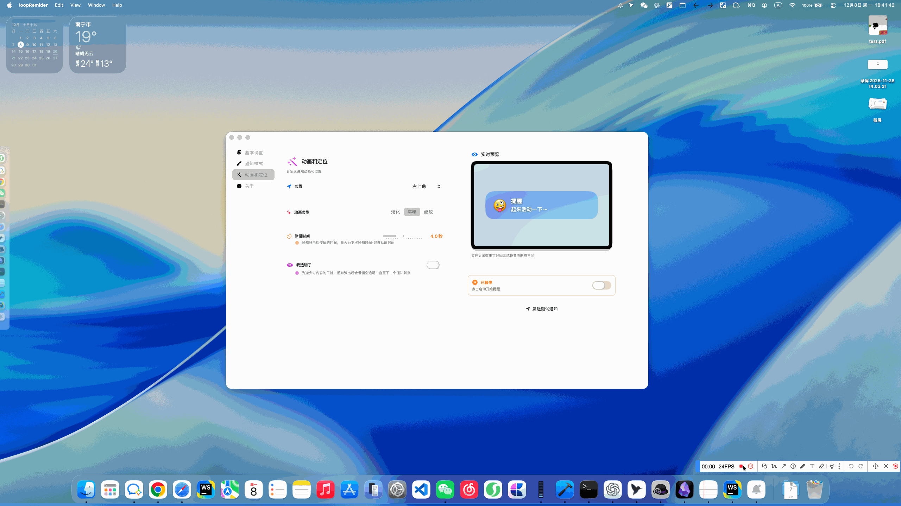

## Loop Reminder

一款简洁优雅的 macOS 循环提醒工具，帮助你保持健康的工作习惯。

## ✨ 特性

- ⏰ **灵活提醒** - 自定义提醒间隔，定时提醒你休息活动
- 🎨 **双通知模式** - 支持系统通知和屏幕遮罩两种方式
- ✨ **精美动画** - 多种进入/退出动画效果可选
- 🌈 **高度自定义** - 位置、颜色、尺寸、透明度等全面可调
- 💫 **渐透明效果** - 通知可在停留期间逐渐变透明，减少干扰
- 🚀 **轻量高效** - 常驻菜单栏，低资源占用

## 📸 预览

## 🎯 使用

1. 点击菜单栏“铃铛”图标打开设置
    

2. 配置提醒内容、频率和样式、动画效果
3. 点击"启动"开始循环提醒

## 🔧 系统要求

- macOS 14.0+(目前暂时仅在macOS26下经过测试)

## 📝 开发

基于 SwiftUI 和 MenuBarExtra 构建。
纯本地app。

## 📄 许可证

MIT License
